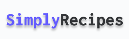
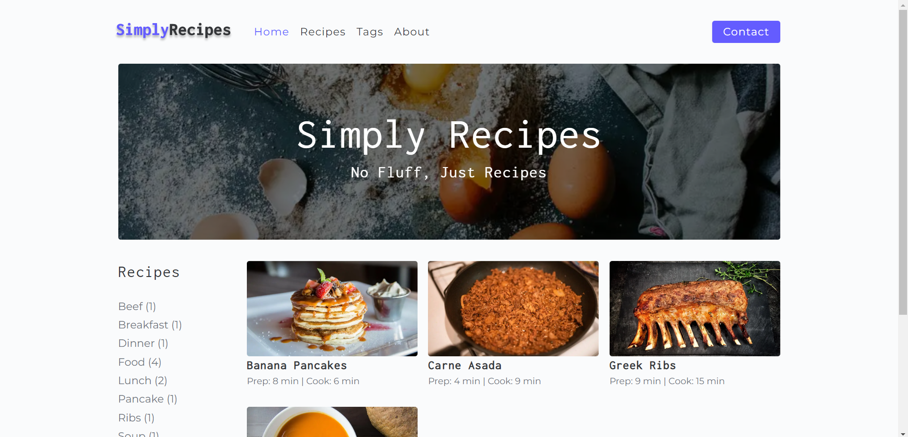

<h1 align="center">
  
</h1>

  <a href="#-techs">Techs</a>&nbsp;&nbsp;&nbsp;|&nbsp;&nbsp;&nbsp;
  <a href="#-about">About</a>&nbsp;&nbsp;&nbsp;|&nbsp;&nbsp;&nbsp;
  <a href="#-how-to">How to</a>&nbsp;&nbsp;&nbsp;

 

  

## ✨ Techs

This project is made using:

- [React](https://reactjs.org)
- [GatsbyJS](https://www.gatsbyjs.com/)
- [ReactIcons](https://react-icons.github.io/react-icons)
- [ContentFulAPI](https://www.contentful.com/)

## 💻 About

Simply Recipes is my first project using GatsbyJS.

## 🚀 How to

- Clone the repository
- Install packages with `yarn` or `npm install`
- Create the variable: CONTENTFUL_API_KEY
- Run `gatsby develop`

Now you can access [`localhost:8000`](http://localhost:8000)

## Author

👤 **Nikson Rotondaro**

- Website: https://simply-recipes-nikson.netlify.app/
- Twitter: [https:\/\/twitter.com\/NoskinR](https://twitter.com/NoskinR)
- Github: [@NRotondaro](https://github.com/NRotondaro)
- LinkedIn: [https:\/\/www.linkedin.com\/in\/nikson-rotondaro\/](https://www.linkedin.com/in/nikson-rotondaro/)

## Show your support

Give a ⭐️ if this project helped you!

---
